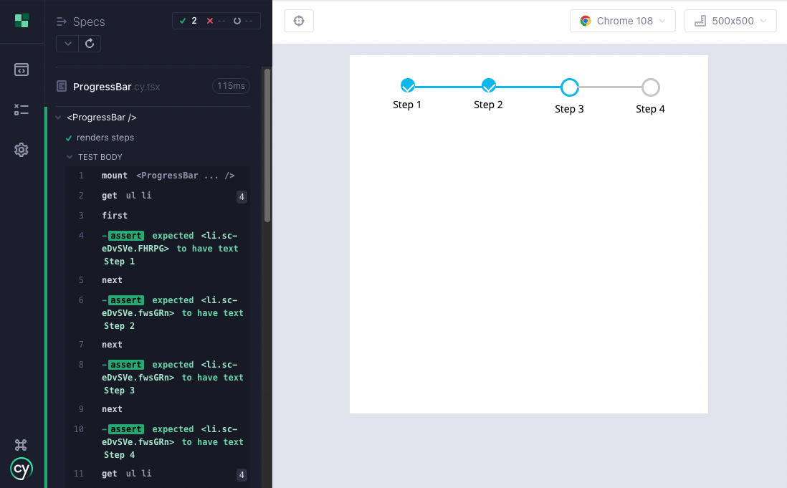

# Cypress Unit Test Starter

A small repository to demonstrate unit testing of Progress Bar component in Cypress. It's built with React in TypeScript and styling with styled-components. For more information see the following tutorial

https://medium.com/@koalamango/cypress-unit-testing-react-components-with-typescript-77b38e5043b3





### Development

```bash
# To develop
yarn start

# To build
yarn build

# To test
yarn test:unit
```
